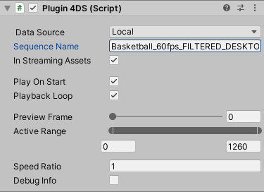

# 4D View模型

到[4D View網站][4DView_Resource]下載模型，解壓縮後放入Assets/StreamingAssets

打開場景Assets/Scenes/MultiCameraTest.unity，將4D View填入模型名稱

    
    

[4DView_Resource]: https://www.4dviews.com/volumetric-resources

# Camera 控制

程式碼放在Assets/Scripts/MultiCameraController.cs

| 按鍵   | 功能                                   |
| :----- | :------------------------------------- |
| 左右鍵 | 切換Camera                             |
| p      | 暫停/播放動畫                          |
| s      | 儲存Camera畫面到Assets/StreamingAssets |